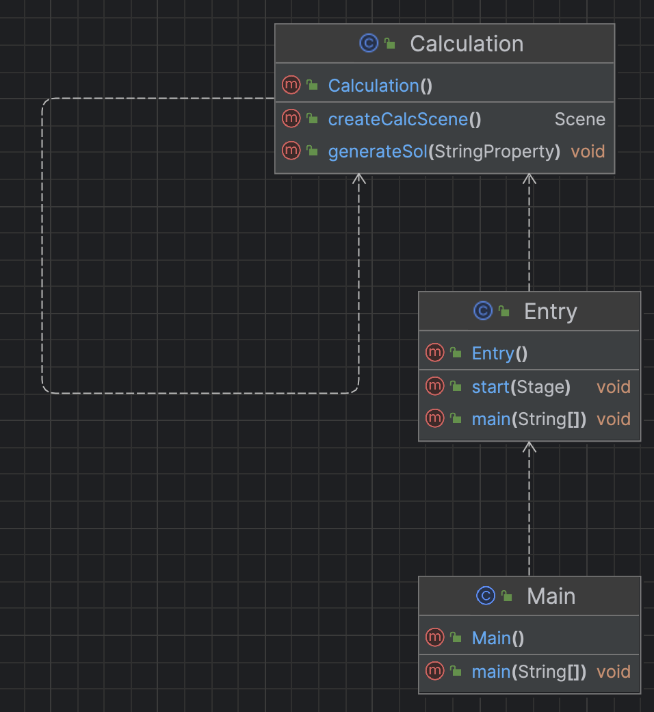

# Simple Calculator with JavaFX

This project is a simple calculator application built using JavaFX. It demonstrates how to build a graphical user interface (GUI) for a basic calculator with the following operations: addition, subtraction, multiplication, and division. 

## Features

- Basic arithmetic operations: addition, subtraction, multiplication, and division.
- Clean and responsive GUI using JavaFX.
- Exception handling for invalid input.

## Installation

1. Clone this repository to your local machine:
   ```bash
   git clone https://github.com/yourusername/simple-calculator-javafx.git
   ```

2. Navigate into the project directory:
   ```bash
   cd simple-calculator-javafx
   ```

3. If you don't already have the `custom-java-math-library`, download or clone it:
   ```bash
   git clone https://github.com/yourusername/custom-java-math-library.git
   ```

4. Add the `custom-java-math-library` to your project:
   - In your IDE, add the `custom-java-math-library` as a dependency or include it in your project structure.

## Usage

1. Compile the project:
   ```bash
   javac -d bin src/com/calculator/*.java src/com/custommath/*.java
   ```

2. Run the application:
   ```bash
   java -cp "bin;path/to/javafx-sdk/lib/*" com.calculator.CalculatorApp
   ```

3. You can now use the calculator to perform basic and advanced mathematical operations. The advanced operations are handled by methods from the `custom-java-math-library`.

## Project Structure
### UML Diagram

### Project Tree

```
.
├── dependency-reduced-pom.xml
├── out
│   └── artifacts
│       └── Calculator_jar
│           └── Calculator.jar
├── pom.xml
├── src
│   ├── main
│   │   ├── java
│   │   │   └── base
│   │   │       ├── Calculation.java
│   │   │       ├── Entry.java
│   │   │       └── Main.java
│   │   └── resources
│   │       ├── META-INF
│   │       │   └── MANIFEST.MF
│   │       └── style.css
│   └── test
│       └── java
└── target
    ├── Calculator-1.0-SNAPSHOT.jar
    ├── classes
    │   ├── META-INF
    │   │   └── MANIFEST.MF
    │   ├── base
    │   │   ├── Calculation.class
    │   │   ├── Entry.class
    │   │   └── Main.class
    │   └── style.css
    ├── generated-sources
    │   └── annotations
    ├── generated-test-sources
    │   └── test-annotations
    ├── maven-archiver
    │   └── pom.properties
    ├── maven-status
    │   └── maven-compiler-plugin
    │       ├── compile
    │       │   └── default-compile
    │       │       ├── createdFiles.lst
    │       │       └── inputFiles.lst
    │       └── testCompile
    │           └── default-testCompile
    │               ├── createdFiles.lst
    │               └── inputFiles.lst
    ├── original-Calculator-1.0-SNAPSHOT.jar
    └── test-classes
```
## How It Works
The three classes for this project are Main, Entry and Calculation. Calculation handles the entire UI and logic, Entry handles JavaFX scene setup and launch and Main acts as the main entrypoint used to package the project into a JAR executable using Maven.

## Contributing

1. Fork this repository.
2. Create a feature branch (`git checkout -b feature-name`).
3. Commit your changes (`git commit -am 'Add new feature'`).
4. Push to the branch (`git push origin feature-name`).
5. Create a new Pull Request.

## License

This project is licensed under the MIT License - see the [LICENSE](LICENSE) file for details.
